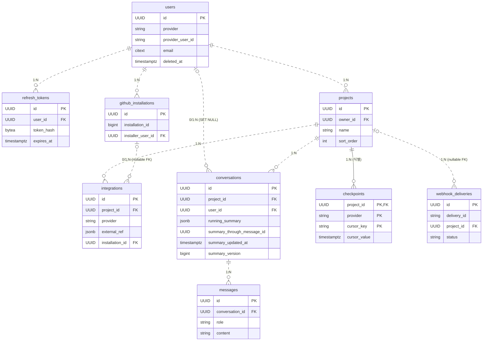

# DB 스키마

backend 서비스(`services/backend`)의 PostgreSQL 테이블 정의 및 관계를 기술한다.
마이그레이션 파일: `src/main/resources/db/migration/V1~V9`

---

## 테이블 관계도

> **선 종류**: 실선(`--`) = 식별 관계(자식 PK에 부모 FK 포함), 점선(`..`) = 비식별 관계
> **카디널리티**: `||` 정확히 1, `|o` 0 또는 1, `o{` 0 이상, `|{` 1 이상

---

## 테이블 정의

### `users`

소셜 로그인(OAuth) 사용자 계정. soft-delete(`deleted_at`)로 관리된다.

| 컬럼 | 타입 | 제약 | 설명 |
|------|------|------|------|
| `id` | UUID | PK | 사용자 고유 식별자 |
| `provider` | TEXT | NOT NULL | OAuth 제공자 (MVP: `github`) |
| `provider_user_id` | TEXT | NOT NULL | provider 발급 안정 식별자 |
| `email` | CITEXT | NOT NULL | OAuth 콜백 이메일 (대소문자 무시) |
| `display_name` | TEXT | | OAuth 프로필 이름 |
| `avatar_url` | TEXT | | OAuth 프로필 이미지 URL |
| `created_at` | TIMESTAMPTZ | NOT NULL | 사용자 최초 생성 시각 |
| `updated_at` | TIMESTAMPTZ | NOT NULL | row 수정 시각 |
| `deleted_at` | TIMESTAMPTZ | soft-delete 마커 | 탈퇴 시각. NULL이면 활성 사용자 |

**인덱스**
- UNIQUE `(provider, provider_user_id)` WHERE `deleted_at IS NULL`
- `(email)`
- `(deleted_at)` WHERE `deleted_at IS NOT NULL` — purge 후보 조회용

---

### `refresh_tokens`

JWT refresh token 저장. token 값은 해시(BYTEA)로만 보관한다.

| 컬럼 | 타입 | 제약 | 설명 |
|------|------|------|------|
| `id` | UUID | PK | refresh token 레코드 ID |
| `user_id` | UUID | NOT NULL, FK → `users.id` CASCADE | 토큰 소유자 |
| `token_hash` | BYTEA | NOT NULL, UNIQUE | refresh token 해시 (평문 저장 금지) |
| `expires_at` | TIMESTAMPTZ | NOT NULL | 토큰 만료 시각 |
| `created_at` | TIMESTAMPTZ | NOT NULL | 토큰 발급 시각 |

---

### `github_installations`

GitHub App 설치 정보. installation token은 암호화해 캐싱한다.

| 컬럼 | 타입 | 제약 | 설명 |
|------|------|------|------|
| `id` | UUID | PK | installation 레코드 ID (내부) |
| `installation_id` | BIGINT | NOT NULL, UNIQUE | GitHub 발급 installation ID (외부) |
| `account_type` | TEXT | NOT NULL | `User` 또는 `Organization` |
| `account_login` | TEXT | NOT NULL | GitHub 사용자명 또는 조직명 |
| `installer_user_id` | UUID | NOT NULL, FK → `users.id` CASCADE | App을 처음 설치한 사용자 |
| `encrypted_installation_token` | BYTEA | | 60분 유효 installation token 캐시 (AES-GCM) |
| `installation_token_expires_at` | TIMESTAMPTZ | | 캐시된 token 만료 시각 |
| `created_at` | TIMESTAMPTZ | NOT NULL | App 설치 시각 |
| `updated_at` | TIMESTAMPTZ | NOT NULL | token 갱신 시각 |

---

### `projects`

사용자가 생성한 분석 프로젝트.

| 컬럼 | 타입 | 제약 | 설명 |
|------|------|------|------|
| `id` | UUID | PK | 프로젝트 ID |
| `owner_id` | UUID | NOT NULL, FK → `users.id` CASCADE | 프로젝트 소유자 |
| `name` | TEXT | NOT NULL | 프로젝트 표시 이름 |
| `description` | TEXT | | 프로젝트 설명 |
| `sort_order` | INTEGER | NOT NULL, DEFAULT 0 | 소유자 단위 수동 정렬 순서(오름차순). 드래그로 재정렬, 신규는 목록 끝 |
| `created_at` | TIMESTAMPTZ | NOT NULL | 프로젝트 생성 시각 |
| `updated_at` | TIMESTAMPTZ | NOT NULL | 메타데이터 변경 시각 |

**인덱스**
- `(owner_id)`
- `(owner_id, sort_order)` — 소유자 프로젝트를 정렬 순서로 조회
- UNIQUE `(owner_id, lower(name))` — 같은 사용자 내 프로젝트명 중복 불가

---

### `integrations`

프로젝트에 연결된 외부 서비스 연동 정보. 서비스별 식별자는 `external_ref`(JSONB)에 저장한다.

| 컬럼 | 타입 | 제약 | 설명 |
|------|------|------|------|
| `id` | UUID | PK | 연동 레코드 ID |
| `project_id` | UUID | NOT NULL, FK → `projects.id` CASCADE | 이 연동이 속한 프로젝트 |
| `provider` | TEXT | NOT NULL, CHECK IN (`github`, `slack`, `jira`) | 외부 시스템 종류 |
| `external_ref` | JSONB | NOT NULL | provider별 식별자 묶음 |
| `installation_id` | UUID | FK → `github_installations.id` CASCADE, nullable | GitHub 연동 시 installation 참조 |
| `encrypted_credential` | BYTEA | nullable | Slack·Jira PAT·API key 암호화 보관 (AES-GCM) |
| `created_at` | TIMESTAMPTZ | NOT NULL | 연동 등록 시각 |
| `updated_at` | TIMESTAMPTZ | NOT NULL | 메타데이터 변경 시각 |

**CHECK 제약**
- `provider = 'github'` → `installation_id NOT NULL`, `encrypted_credential NULL`
- `provider IN ('slack', 'jira')` → `installation_id NULL`, `encrypted_credential NOT NULL`

**`external_ref` JSON 키**
- GitHub: `repository_id`, `repository_full_name`
- Slack: `workspace_id`, `workspace_name`
- Jira: `project_key`, `project_name`, `base_url`

**인덱스**
- UNIQUE `(project_id, provider)`
- `(installation_id)` WHERE `installation_id IS NOT NULL`
- `(external_ref->>'repository_full_name')` WHERE `provider = 'github'`

---

### `conversations`

AI 질의 대화 세션. 사용자가 탈퇴하면 `user_id`가 NULL로 유지된다.

| 컬럼 | 타입 | 제약 | 설명 |
|------|------|------|------|
| `id` | UUID | PK | 대화(스레드) ID |
| `project_id` | UUID | NOT NULL, FK → `projects.id` CASCADE | 대화가 속한 프로젝트 |
| `user_id` | UUID | FK → `users.id` SET NULL, nullable | 대화 생성자 (탈퇴 시 NULL로 익명화) |
| `title` | TEXT | | 대화 제목 |
| `created_at` | TIMESTAMPTZ | NOT NULL | 대화 시작 시각 |
| `updated_at` | TIMESTAMPTZ | NOT NULL | 마지막 메시지 추가 시각 |
| `running_summary` | JSONB | nullable | 최근 원문 이력보다 오래된 완성 대화 턴의 누적 요약 |
| `summary_through_message_id` | UUID | nullable | 누적 요약에 마지막으로 포함된 ASSISTANT 메시지 ID |
| `summary_updated_at` | TIMESTAMPTZ | nullable | 누적 요약 최종 갱신 시각 |
| `summary_version` | BIGINT | NOT NULL, DEFAULT 0 | 동시 요약 갱신 충돌 감지를 위한 CAS 버전 |

**인덱스**
- `(project_id, updated_at DESC)`
- `(user_id, updated_at DESC)` WHERE `user_id IS NOT NULL`

---

### `messages`

대화 내 개별 메시지.

| 컬럼 | 타입 | 제약 | 설명 |
|------|------|------|------|
| `id` | UUID | PK | 메시지 ID |
| `conversation_id` | UUID | NOT NULL, FK → `conversations.id` CASCADE | 메시지가 속한 대화 |
| `role` | TEXT | NOT NULL, CHECK IN (`USER`, `ASSISTANT`, `SYSTEM`) | 작성자 종류 |
| `content` | TEXT | NOT NULL | 메시지 본문 |
| `metadata` | JSONB | nullable | ASSISTANT 응답 부가정보 — `structured`(요약·`evidence` 근거) 또는 질의 실패 마커(`fallback`, `error_type`) |
| `created_at` | TIMESTAMPTZ | NOT NULL | 메시지 생성 시각 |

**인덱스**
- `(conversation_id, created_at ASC)`

---

### `checkpoints`

pipeline-worker의 수집 커서 위치를 저장한다. `(project_id, provider, cursor_key)` 복합 PK.

| 컬럼 | 타입 | 제약 | 설명 |
|------|------|------|------|
| `project_id` | UUID | PK 일부, FK → `projects.id` CASCADE | 체크포인트가 속한 프로젝트 |
| `provider` | TEXT | PK 일부, CHECK IN (`github`, `jira`, `slack`) | 외부 시스템 종류 |
| `cursor_key` | TEXT | PK 일부 | 수집 종류 (`github_commits`, `github_pull_requests` 등) |
| `cursor_value` | TIMESTAMPTZ | NOT NULL | 마지막으로 처리한 cursor 시각 |
| `updated_at` | TIMESTAMPTZ | NOT NULL | 마지막 갱신 시각 |

---

### `webhook_deliveries`

웹훅 중복 처리 방지용 수신 기록.

| 컬럼 | 타입 | 제약 | 설명 |
|------|------|------|------|
| `id` | UUID | PK | delivery 레코드 ID |
| `delivery_id` | TEXT | NOT NULL, UNIQUE | GitHub `X-GitHub-Delivery` 헤더 값 (중복 처리 차단 키) |
| `project_id` | UUID | FK → `projects.id` CASCADE, nullable | 매칭된 프로젝트 (매칭 실패 시 NULL) |
| `status` | TEXT | NOT NULL DEFAULT `IN_PROGRESS`, CHECK IN (`IN_PROGRESS`, `PROCESSED`, `FAILED`) | 처리 상태 |
| `received_at` | TIMESTAMPTZ | NOT NULL | 웹훅 수신 시각 |
| `updated_at` | TIMESTAMPTZ | NOT NULL | 상태 변경 시각 |
| `last_error` | TEXT | nullable | 처리 실패 시 마지막 에러 메시지 |

**인덱스**
- `(project_id, received_at DESC)` WHERE `project_id IS NOT NULL`
