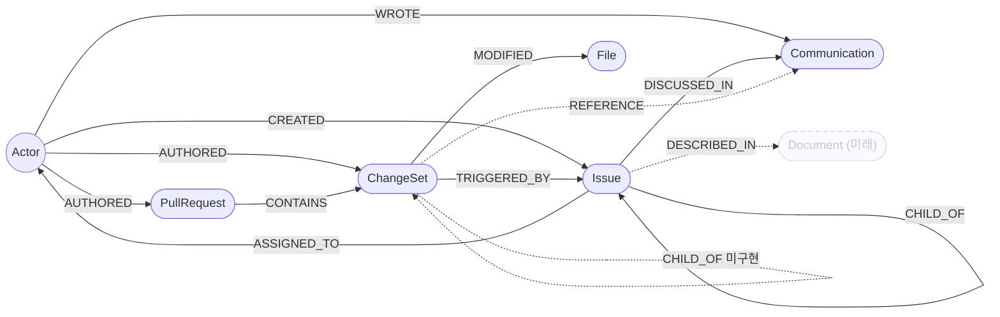

# Graph Schema — 지식 그래프 노드 & 관계 정의

## 공통: 프로젝트 격리 (project_id)

Neo4j는 모든 프로젝트가 공유하는 단일 저장소다. 테넌트 격리를 위해:

- pipeline-worker가 발행하는 모든 NormalizedEvent는 최상위에 `projectId`(프로젝트 UUID)를 갖는다.
  ai-engine은 `projectId` 없는 이벤트를 그래프에 쓰지 않고 건너뛴다.
- 모든 도메인 노드는 `project_id` 속성을 가지며, MERGE 키는 `(project_id, 자연키)` 복합 키다.
  `pr_number`, `path`, `jira_key` 같은 자연키는 프로젝트(레포/워크스페이스)마다 충돌하기 때문.

| 노드 | 복합 유니크 키 |
|------|----------------|
| ChangeSet | (project_id, hash) |
| PullRequest | (project_id, pr_number) |
| Issue | (project_id, jira_key) |
| Communication | (project_id, url) |
| File | (project_id, path) |
| Actor | uuid (단일) — 단, 생성/조회는 project_id 스코프 |

- 제약은 ai-engine 시작 시 `ensure_constraints()`(graph/builder.py)가 생성한다.
- Actor 동일인 판단(alias/email/이름 매칭)도 project_id 스코프 안에서만 동작한다 —
  같은 사람이 두 프로젝트에 등장하면 프로젝트마다 별도 Actor 노드가 생긴다.
- 배치 작업(REFERENCE, TRIGGERED_BY/DISCUSSED_IN 시맨틱 링크, 스레드 전파, Slack LLM 필터)도
  같은 project_id 안에서만 쌍을 비교/생성한다.

## 노드 목록

### Actor
모든 소스(GitHub, Jira, Slack)의 사용자. ai-engine이 alias를 통합해 동일인을 하나의 노드로 합침.

```json
{
  "uuid": "",            // 고유 식별자
  "project_id": "",      // 소속 프로젝트 UUID — 동일인 판단은 프로젝트 경계를 넘지 않음
  "name": "",            // 표시 이름
  "normalized_name": "", // 정규화 이름 (소문자·특수문자 제거) — 동일인 스코어링에 사용
  "aliases": [""],       // source-scoped ID 목록 (예: "GITHUB:se-zero", "JIRA:123abc")
  "emails": [""],        // 확인된 이메일 목록 — 동일인 판단 1차 기준
  "confidence": 0.0      // 마지막 합산/생성 시점의 신뢰도
}
```

---

### Issue
Jira 티켓.

```json
{
  "projectId": "",                     // 프로젝트 UUID — 노드 project_id로 저장 (격리 기준)
  "nodeType": "Issue",
  "source": "",                        // JIRA
  "occurredAt": "",                    // ISO-8601 — Jira updated 시각 기준 (변경 이력 반영); 생성만 있으면 created 사용
  "actor": { "id": "", "name": "", "email": "" },  // id: GitHub=login, Jira=accountId, Slack=userId / email: null 허용
  "properties": {
    "jira_key": "",                    // Jira 고유 키 (예: HT-7)
    "title": "",                       // 티켓 제목
    "body": "",                        // 티켓 본문
    "status": "",                      // 현재 상태 (예: 진행 중)
    "issue_type": "",                  // Task | Bug | Story ...
    "priority": "",                    // 우선순위 (예: Medium)
    "assignee": "",                    // 담당자 이름
    "created_at": "",                  // 티켓 최초 생성 시각 (ISO-8601); occurredAt이 updated 기준이므로 보존
    "closed_at": ""                    // 종료 시각 (ISO-8601, terminal status일 때만 전달) → 노드 closedAt 저장. TRIGGERED_BY 비대칭 윈도우 계산에 사용
  },
  "refs": {}                            // 예: { "jiraKey": "PAYMENT-301", "parentJiraKey": "HT-1", "assigneeId": "abc123" }
}
```

---

### Communication
Slack 메시지 또는 GitHub Issue. 텍스트 기반 의사소통 단위.

```json
{
  "projectId": "",                     // 프로젝트 UUID — 노드 project_id로 저장 (격리 기준)
  "nodeType": "Communication",
  "source": "",                        // SLACK | GITHUB
  "occurredAt": "",                    // ISO-8601
                                       // SLACK: 메시지 ts (Unix epoch 소수) 변환 기준
                                       // GITHUB: updated_at 기준 (fallback: created_at)
  "actor": { "id": "", "name": "", "email": "" },  // id: GitHub=login, Jira=accountId, Slack=userId / email: null 허용
  "properties": {
    "body": "",                        // 메시지 본문 (GitHub Issue는 title + "\n\n" + body)
    "channel": "",                     // Slack 채널명 또는 "github_issues"
    "url": "",                         // 원본 링크
    "conversation_id": "",             // Slack: 루트 메시지 ts / 스레드 reply는 부모 ts
                                       // GitHub Issue: issue number (string)
    "created_at": ""                   // GitHub Issue 최초 생성 시각 (ISO-8601); SLACK은 null
  },
  "refs": {}                            // 예: { "jiraKey": "PAYMENT-301", "prNumber": "142" }
}
```

---

### PullRequest

GitHub Pull Request. 머지된 PR만 수집한다.

```json
{
  "projectId": "",                     // 프로젝트 UUID — 노드 project_id로 저장 (격리 기준)
  "nodeType": "PullRequest",
  "source": "",                        // GITHUB
  "occurredAt": "",                    // ISO-8601 — merged_at 기준 (fallback: created_at); properties에는 저장 안 됨
  "actor": { "id": "", "name": "", "email": "" },  // id: GitHub=login, Jira=accountId, Slack=userId / email: null 허용
  "properties": {
    "pr_number": "",                   // PR 번호
    "title": "",                       // PR 제목
    "body": "",                        // PR 본문
    "state": "",                       // closed (머지된 PR만 수집)
    "base_branch": "",                 // 머지 대상 브랜치
    "created_at": "",                  // PR 최초 생성 시각 (ISO-8601)
    "url": ""                          // PR 링크
  },
  "refs": {}                            // 예: { "jiraKeys": ["PAYMENT-301", "HT-7"] } — 제목/본문에서 추출. 이벤트 처리 시 pr.jira_keys 노드 속성으로 저장되어, 그 PR의 CONTAINS 커밋에 text TRIGGERED_BY 전파에 사용
}
```

---

### ChangeSet
GitHub Commit. 실제 코드 변경 단위. merge commit은 제외한다.

```json
{
  "projectId": "",                     // 프로젝트 UUID — 노드 project_id로 저장 (격리 기준)
  "nodeType": "ChangeSet",
  "source": "",                        // GITHUB
  "occurredAt": "",                    // ISO-8601 — commit.committer.date 기준 (fallback: commit.author.date)
  "actor": { "id": "", "name": "", "email": "" },  // id: GitHub=login, Jira=accountId, Slack=userId / email: null 허용
  "properties": {
    "hash": "",                        // git commit hash
    "message": "",                     // 커밋 메시지
    "files": [
      {
        "path": "",                    // 파일 경로 → File 노드 upsert에 사용
        "diff": "",                    // unified diff 원문 → LLM diffSummary 생성에 사용
        "additions": 0,                // 추가된 라인 수
        "deletions": 0                 // 삭제된 라인 수
      }
    ]
  },
  "refs": {}                            // 예: { "jiraKey": "PAYMENT-301", "prNumber": "142" }
}
```

> **ai-engine 처리 흐름**
> - `files[].path` → File 노드 upsert
> - `files[].diff` → LLM이 diffSummary 생성 → `MODIFIED` 엣지 속성으로 저장
> - 처리 완료 후 `files[]` 배열은 Neo4j에 저장하지 않음

---

### File
GitHub 저장소 내 파일.

```json
{
  "project_id": "", // 소속 프로젝트 UUID
  "path": ""        // 파일 경로
}
```

---

### Document _(미래)_
장기 문서(기술 스펙, 설계 문서 등). 현재 미구현.

---

## 관계 목록

| 관계 | 방향 | 속성 | 설명 |
|------|------|------|------|
| `CREATED` | `(Actor)→(Issue)` | — | Actor가 Jira 티켓을 생성 |
| `WROTE` | `(Actor)→(Communication)` | — | Actor가 메시지/이슈를 작성 |
| `AUTHORED` | `(Actor)→(PullRequest)`, `(Actor)→(ChangeSet)` | — | Actor가 PR/commit을 생성 |
| `ASSIGNED_TO` | `(Issue)→(Actor)` | — | Jira 이슈의 담당자 |
| `DISCUSSED_IN` | `(Issue)→(Communication)` | `confidence: Float` (시맨틱 엣지만) | 이슈가 대화에서 언급됨. text(`refs.jiraKey`)·스레드 전파 엣지는 속성 없음, 시맨틱 엣지만 confidence 부여 |
| `CHILD_OF` | `(Issue)→(Issue)` | — | 이슈 계층 구조 (Sub-task → Parent). `refs.parentJiraKey` 기반 |
| `CHILD_OF` | `(ChangeSet)→(ChangeSet)` _(미구현)_ | — | 커밋 계층 구조 — 현재 미구현 |
| `TRIGGERED_BY` | `(ChangeSet)→(Issue)` | `source: String (text\|semantic)`, `confidence: Float` | 이슈에 대한 커밋. text=1.0 고정, semantic=코사인 유사도. text가 semantic보다 우선 |
| `CONTAINS` | `(PullRequest)→(ChangeSet)` | — | PR에 포함된 커밋 |
| `MODIFIED` | `(ChangeSet)→(File)` | `diffSummary: String`, `embedding: Float[]` | 커밋이 파일을 변경. LLM이 생성한 diff 요약문과 그 임베딩 저장 |
| `REFERENCE` | `(ChangeSet)→(Communication)` | `confidence: Float (0-1)` | 벡터 유사도 기반 의미적 연결. `diffSummary`와 `body` 임베딩 코사인 유사도가 임계값 이상일 때 생성 |
| `DESCRIBED_IN` | `(Issue)→(Document)` | — | _(미래)_ Actor가 문서에 기술됨 |

---

## 그래프 구조 다이어그램



> 실선: 명시적 관계 (refs 추출 또는 구조적 포함 관계)
> 점선: 의미적/미래 관계 (`REFERENCE` — 벡터 유사도, `DESCRIBED_IN` — 미구현)

---

## 관계 생성 기준

ai-engine은 NormalizedEvent를 4개 레이어로 처리한다.

| 레이어 | 관계 | 생성 조건 | 근거 |
|--------|------|-----------|------|
| Layer 1 | `CREATED` / `WROTE` / `AUTHORED` | 모든 이벤트 | `actor` 필드 |
| Layer 2 | `CHILD_OF` (Issue) | `refs.parentJiraKey` 존재 시 | Issue의 refs (Jira Sub-task → Parent) |
| Layer 2 | `ASSIGNED_TO` | `refs.assigneeId` 존재 시 | Issue의 refs (Jira 담당자 ID) |
| Layer 2 | `DISCUSSED_IN` (text) | `refs.jiraKey` 존재 시 | Communication의 refs |
| Layer 2 | `TRIGGERED_BY` (text) | ChangeSet `refs.jiraKey`, 또는 PR `jira_keys`를 그 PR의 CONTAINS 커밋에 전파 | ChangeSet refs + PR 제목/본문 추출 키. `source='text'`, `confidence=1.0` |
| Layer 2 | `CONTAINS` | `refs.prNumber` 존재 시 | ChangeSet의 refs (GitHub API 기반으로 구축) |
| Layer 3 | `MODIFIED` | ChangeSet 이벤트 | `files[].path` + LLM diffSummary; 임베딩은 MODIFIED 엣지 속성으로 저장 |
| Layer 4 | `REFERENCE` | 배치 처리 | `MODIFIED.embedding` ↔ `Communication.embedding` 코사인 유사도 ≥ 0.44 (기본값), 시간 범위 ±5일 |
| Layer 4 | `DISCUSSED_IN` (시맨틱) | 배치 처리 | `Issue.embedding` ↔ `Communication.embedding` 코사인 유사도 ≥ 0.48 (기본값), 이슈 생애 윈도우 `[createdAt-4d, closedAt+3d / 진행중이면 now]` |
| Layer 4 | `TRIGGERED_BY` (시맨틱) | 배치 처리 | `Issue.embedding` ↔ `MODIFIED.embedding` 코사인 유사도 ≥ 0.34 (기본값). 비대칭 시간 윈도우 `[createdAt-1d, closedAt+3d / 진행중이면 now]`, ChangeSet당 top-1, text 엣지 있는 커밋은 제외 |

> **순서 보장**: Layer 2에서 참조 대상 노드가 아직 없으면 PK만 가진 stub 노드를 생성하고,
> 해당 이벤트가 도착하면 Layer 1에서 properties를 채움.

---

## Layer 4 — 시맨틱 링크 (구현된 생성 방식)

refs(`jiraKey`/`prNumber`)는 커밋·메시지에 명시될 때만 텍스트로 추출되어 자주 비어 있다. 이를 보완해 Issue 연결을 아래 방식으로 생성한다. 모든 배치 비교는 같은 `project_id` 안에서만 수행한다.

### DISCUSSED_IN (Issue → Communication)

1. **text** — Communication `refs.jiraKey`로 직접 연결 (`link_issue_to_communication`, 속성 없음)
2. **스레드 전파** — 같은 `conversation_id` 스레드에 DISCUSSED_IN이 하나라도 있으면 스레드 전체로 전파 (`propagate_thread_discussed_in`, 속성 없음)
3. **시맨틱** — `Issue.embedding` ↔ `Communication.embedding` 코사인 유사도 ≥ `discussed_in_threshold`(기본 0.48), 이슈 생애 윈도우 `[createdAt-4d, closedAt+3d / 진행 중이면 now]`. `confidence` 속성 부여 (`build_issue_communication_links`)

### TRIGGERED_BY (ChangeSet → Issue)

1. **text** — ChangeSet `refs.jiraKey`, 그리고 PR 제목/본문의 `jira_keys`를 그 PR이 머지한 CONTAINS 커밋들에 전파. `source='text'`, `confidence=1.0` (`link_changeset_to_issue`, `link_pr_changesets_to_issues`)
2. **시맨틱** — `Issue.embedding` ↔ `MODIFIED.embedding` 코사인 유사도 ≥ `triggered_by_threshold`(기본 0.34 — text 엣지가 전혀 없는 커밋만 후보라 낮은 값이 안전하다). 비대칭 시간 윈도우 `[createdAt-1d, closedAt+3d / 진행 중이면 now]`, ChangeSet당 top-1만 유지, text 엣지가 이미 있는 커밋은 제외(text 우선). `source='semantic'`, `confidence=점수` (`build_issue_changeset_links`)

### 실행 트리거 — 자동(디바운스) + 수동

위 시맨틱 빌더들은 노드 쌍을 전수 비교하는 O(n²) 배치라 이벤트마다 돌릴 수 없다. `postprocess.py`가 오케스트레이션한다.

- **자동(유휴 디바운스)**: consumer가 이벤트 처리마다 `mark_dirty()`를 호출하고, `start_debounce_loop`(lifespan 태스크)가 수집 큐가 `GRAPH_BUILD_DEBOUNCE_SECONDS`(기본 30초) 이상 잠잠해지면 후처리 시퀀스를 1회 실행한다. 수집은 webhook 포함 증분이라 "완료 시점"이 없으므로 유휴 감지로 트리거한다. `GRAPH_BUILD_MIN_INTERVAL_SECONDS`(기본 300초) 쿨다운으로 버스트 시 과다 재스캔을 막는다.
- **수동**: `POST /graph/build?verify=`로 디바운스를 기다리지 않고 즉시 실행한다(웹 대시보드 '그래프 재구축' 버튼의 연결점). backend는 `POST /api/v1/projects/{projectId}/graph/build`로 프록시한다.

두 경로는 `_build_lock`으로 직렬화되며 모든 단계가 idempotent다.

**시퀀스 순서** (`run_postprocess_sequence`):
0. Slack LLM 노이즈 필터 (`llm_filtered=false`인 신규 Slack 메시지만, 증분) — 링크 전에 노이즈 제거
0.5. (verify=true만) 시맨틱 TRIGGERED_BY/DISCUSSED_IN clear + REFERENCE clear — 임베딩 유사도로 만든 결과를 비우고 재구축. REFERENCE까지 비우는 건 필터형이 "만들지 않을" 뿐 기존 엣지를 지우지는 못하기 때문이다 — clear가 없으면 이전 빌드의 엣지가 그대로 남아 필터가 무력화된다
1. 임베딩 누락 Communication 보정 (`backfill_communication_embeddings`)
2. TRIGGERED_BY + DISCUSSED_IN 시맨틱 링크
3. REFERENCE 시맨틱 링크
4. DISCUSSED_IN 스레드 전파

### LLM 검수 (자동구축 vs 수동 정밀 구축)

구분은 `/graph/build`의 `verify` 플래그 하나로 정한다.

- **자동구축** (`verify=false`, 디바운스 자동 빌드 기본값): 임베딩 유사도만 사용. 빠르고 LLM 비용 없음. 수동 '그래프 재구축' 버튼도 이 경로를 쓴다 — 트리거가 수동일 뿐 방식은 같다.
- **수동 정밀 구축** (`verify=true`): 기존 시맨틱 엣지를 먼저 비운 뒤(`clear_semantic_triggered_by`/`clear_semantic_discussed_in`/`clear_reference`) LLM이 개입하는 빌더로 재구축한다. 임베딩만으로 생기는 false positive(도메인 용어 중복 등)를 줄이지만 호출당 LLM 비용이 든다. 수동 '정밀 재구축'에서만 사용.

  `verify=true`는 단일 방식이 아니라 **엣지 타입별로 채택된 방식이 다르다**:

  | 엣지 타입 | 방식 | 동작 |
  |-----------|------|------|
  | TRIGGERED_BY | 추천형 (`build_issue_changeset_links_verified`) | 임계값을 낮춰 후보를 넓게 잡고 LLM이 최종 선택 — 임베딩이 못 고른 엣지를 **추가할 수 있다** |
  | DISCUSSED_IN | 필터형 (`build_issue_communication_links_filtered`) | 임베딩이 확정한 쌍만 검수 — 걸러내기만 하고 **추가는 없다** |
  | REFERENCE | 필터형 (`build_reference_edges_filtered`) | 위와 동일 |

  clear 범위는 타입마다 다르다. TRIGGERED_BY·DISCUSSED_IN은 `source='semantic'`인 엣지만 지워 text(refs)·스레드 전파 엣지는 보존된다. 반면 REFERENCE는 텍스트 경로가 없어 전부 시맨틱 산물이므로 **전량 삭제 후 재생성**된다.

### API — `POST /issue-links/build` (하위 단계 직접 호출)

오케스트레이션 없이 Issue 링크 단계만 직접 부르는 저수준 엔드포인트. 위 `/graph/build`는 이 단계를 포함한 전체 시퀀스를 돌린다. **임베딩 유사도 전용이다** — LLM 검수까지 포함한 조합은 `POST /graph/build?verify=true`로 실행한다.

| 파라미터 | 기본값 | 설명 |
|----------|--------|------|
| `triggered_by_threshold` | `0.34` | TRIGGERED_BY 임베딩 유사도 최소값 |
| `triggered_by_message_mode` | `"max"` | 커밋 메시지 임베딩 비교 방식 (`off`/`max`/`only`) |
| `discussed_in_threshold` | `0.48` | DISCUSSED_IN 임베딩 유사도 최소값 |
| `discussed_in_margin` | `0.10` | DISCUSSED_IN fan-out 컷 — 이슈 최고점 스레드와의 허용 점수차 |
| `discussed_in_pre_days` | `4` | DISCUSSED_IN 시간 윈도우 — 이슈 생성 이전 며칠까지 후보로 볼지 |
| `discussed_in_post_days` | `3` | DISCUSSED_IN 시간 윈도우 — 이슈 종료 이후 며칠까지 후보로 볼지 |
