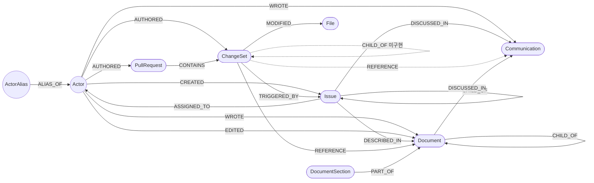

# Graph Schema — 지식 그래프 노드 & 관계 정의

## 공통: 프로젝트 격리 (project_id)

Neo4j는 모든 프로젝트가 공유하는 단일 저장소다. 테넌트 격리를 위해:

- pipeline-worker가 발행하는 모든 NormalizedEvent는 최상위에 `projectId`(프로젝트 UUID)를 갖는다.
  ai-engine은 `projectId` 없는 이벤트를 그래프에 쓰지 않고 건너뛴다.
- 모든 도메인 노드는 `project_id` 속성을 가지며, MERGE 키는 `(project_id, 자연키)` 복합 키다.
  `pr_number`, `path` 같은 자연키는 프로젝트(레포/워크스페이스)마다 충돌하기 때문.
- Issue만 자연키에 `source`가 추가로 들어간다 — 한 프로젝트에 이슈 소스가 둘 이상 붙을 수
  있고(예: Jira+Linear), 사람용 키(`HT-7`)는 가변이라 플랫폼 **불변 ID**(`external_id`)를 쓴다.
  사람용 키는 표시·검색용 속성 `issue_key`(nullable)로 강등됐다 (보조 인덱스 `issue_display_key`).

| 노드 | 복합 유니크 키 |
|------|----------------|
| ChangeSet | (project_id, hash) |
| PullRequest | (project_id, pr_number) |
| Issue | (project_id, source, external_id) — `issue_key`는 표시용 속성 |
| Communication | (project_id, url) |
| Document | (project_id, source, external_id) |
| DocumentSection | (project_id, source, document_external_id, ordinal) |
| File | (project_id, path) |
| Actor | uuid (단일) — 단, 생성/조회는 project_id 스코프 |
| ActorAlias | (project_id, source_id) |

- 제약은 ai-engine 시작 시 `ensure_constraints()`(graph/builder.py)가 생성한다.
- Actor 동일인 판단(alias/email/이름 매칭)도 project_id 스코프 안에서만 동작한다 —
  같은 사람이 두 프로젝트에 등장하면 프로젝트마다 별도 Actor 노드가 생긴다.
- 배치 작업(REFERENCE, TRIGGERED_BY/DISCUSSED_IN 시맨틱 링크, 스레드 전파, Slack LLM 필터)도
  같은 project_id 안에서만 쌍을 비교/생성한다.

## 삭제 (cascade)

그래프를 지우는 경로는 둘이고, 스코프가 다르다. 둘 다 backend가 인가를 통과시킨 뒤 호출하는
내부 API이며 멱등이다(대형 프로젝트의 tx timeout을 피해 배치 커밋한다).

| 트리거 | 엔드포인트 | 범위 |
|--------|-----------|------|
| 프로젝트 삭제 · 회원 탈퇴 | `DELETE /graph/projects/{project_id}` | 그 프로젝트의 모든 노드(Actor 포함) |
| 연동 해제 | `DELETE /graph/projects/{project_id}/sources/{source}` | 그 소스에서 수집한 노드만 |

**소스 단위 삭제(`delete_project_source_graph`)는 다섯 단계다.** `source` 속성 하나로 지우고
끝낼 수 없는 이유가 각 단계에 있다.

1. **도메인 노드** — `source` 속성으로 스코프한다. `Communication`이 SLACK·GITHUB 공용이라
   라벨이 아니라 속성으로 걸러야 한다. Issue 실노드·parent pre-node는 여기서 잡히지만,
   `__stub__` 센티널은 특정 소스 소속이 아니라 안 잡힌다 — 5단계 참고. `Document`·
   `DocumentSection`도 둘 다 `source` 속성을 가지므로 라벨을 한정하지 않는 이 단계가 자동으로
   함께 지운다 — File처럼 별도 고아 정리가 필요 없다(`DocumentSection`엔 `source`가 있다).
2. **고아 File** — `File`은 `(project_id, path)`뿐이라 `source`가 없다(GitHub 전용 파생 노드).
   ChangeSet이 사라지면 `MODIFIED`가 끊긴 채 남으므로 별도로 정리한다.
3. **Actor** — 소스를 가로지른다(`aliases: ["GITHUB:x", "SLACK:y"]`). 가진 alias가 **전부**
   해당 소스인 Actor만 삭제하고, 다른 소스가 남은 Actor는 배열에서 그 alias만 뺀다.
   `ActorAlias` 인덱스 노드(`pd_name`·`pd_email` 포함)도 함께 지운다(Step 0 조회가 이걸 탄다) —
   개인정보는 ActorAlias에 소스별로 저장되므로 이 삭제가 곧 그 소스에서 받은 개인정보 삭제를
   겸한다. 살아남은 Actor는 표시 이름을 재계산한다(`recompute_display_name`) — 지워진 소스가
   표시 이름의 출처였다면 그 개인정보가 `Actor.name`에 남기 때문이다.
4. **ActorDecision** — 수동 병합·분리 기록 중 한쪽 alias 묶음이 통째로 사라진 것은 적용
   대상이 없어 삭제한다. 양쪽 모두 남아 있으면 보존한다(재수집 후 다시 적용돼야 한다).
5. **고아 `__stub__` Issue** — 센티널 stub은 특정 소스 소속이 아니므로 원칙적으로 남긴다
   (타 소스 이벤트가 만든 미해결 참조일 수 있다). 1단계에서 참조하던 노드가 지워져 엣지가
   하나도 안 남은 stub만 의미를 잃었으므로 여기서 수거한다.

**소스 삭제 후 같은 소스를 재수집해도 타 소스 이벤트가 만들었던 크로스 엣지는 복원되지
않는다** — 예: JIRA 삭제 시 커밋→이슈 text `TRIGGERED_BY`가 함께 지워지는데(DETACH), Jira
재수집은 Issue 노드만 되살리고 커밋 이벤트는 재처리되지 않는다. 시맨틱 엣지는 다음 Layer 4
빌드가 다시 만들지만, text 엣지의 완전 복원은 참조 소스(GitHub) 재수집이 필요하다.

RDB 쪽(연동 행·checkpoint) 삭제는 backend가 담당한다 — `services/backend/CLAUDE.md` 참고.

## 노드 목록

### Actor
모든 소스(GitHub, Jira, Slack, Linear)의 사용자. ai-engine이 alias를 통합해 동일인을 하나의 노드로 합침.
개인정보(이름·이메일)는 담지 않는다 — 아래 ActorAlias에 소스별로 저장하고, Actor는 거기서
유도한 표시 이름과 조회 키(aliases)만 갖는다.

```json
{
  "uuid": "",             // 고유 식별자
  "project_id": "",       // 소속 프로젝트 UUID — 동일인 판단은 프로젝트 경계를 넘지 않음
  "name": "",             // 표시 이름 — ActorAlias로부터 파생되는 값 (derive_display_name)
  "aliases": [""],        // source-scoped ID 목록 (예: "GITHUB:se-zero", "JIRA:123abc")
  "manual_name": false,   // (수동 변경 시에만) 운영자가 표시 이름을 직접 확정했는지
  "name_updated_at": "",  // (수동 변경 시에만) 마지막 수동 변경 시각 (ISO-8601)
  "bot": false            // 봇 계정 여부 (예: Linear AI 에이전트 위임). 없으면 false로 간주
}
```

표시 이름 유도 규칙(`derive_display_name`, `graph/actor_store.py`): 수동 확정(manual_name) >
GitHub 프로필 이름(login 대체값 제외) > 이름 있는 소스 중 활동량 최다(동률은 소스명 사전순) >
GitHub login > "(삭제된 사용자)". `bot=true`면 유도된 이름 뒤에 "(봇)"을 붙인다(수동 확정 시는 제외).

봇 격리(`graph/actor_resolver.py`): `actor.bot=true`로 도착한 이벤트는 이메일/이름 기반 동일인
매칭(Step 1~3)을 건너뛰고 alias 기반으로 곧장 생성/조회된다. 반대로 사람 동일인 매칭
(`_lookup_actor_by_email`/`_lookup_actor_by_name`, `graph/actor_store.py`)도 봇 Actor를 후보에서
제외한다 — 봇이 사람에 병합되는 것과 사람이 봇에 병합되는 것을 양방향으로 막는다.

---

### ActorAlias
Actor가 가진 소스 계정 하나 (예: `GITHUB:se-zero`, `JIRA:5b10a2`). 개인정보(이름·이메일)와 그
획득/삭제 상태를 담아 "어느 정보가 어느 소스에서 왔는지"를 구분 가능하게 한다 — Actor 동일인
판단(Step 0~2)의 조회 키이자 Atlassian 개인정보 보고·삭제 단위다.

```json
{
  "project_id": "",           // 소속 프로젝트 UUID
  "source_id": "",            // 소스-스코프 계정 ID (예: "JIRA:5b10a2") — (project_id, source_id) 유니크
  "source": "",                // JIRA | GITHUB | SLACK — 보고 대상을 전역으로 훑는 열거 키
  "pd_name": "",               // 이 계정에서 받은 이름 — 표시 이름 유도 재료
  "pd_normalized_name": "",    // 정규화 이름 — Step 2 후보 조회 키
  "pd_email": "",              // 이 계정에서 받은 이메일 — Step 1 매칭 키
  "pd_updated_at": "",         // 이 개인정보를 획득한 시각 (ISO-8601)
  "pd_reported_at": "",        // Atlassian 개인정보 보고 시각 (Jira alias에만 의미)
  "pd_erased": null            // 삭제 사유 — null(정상) | "closed"(계정 폐쇄) | "access_lost"(재조회 불가)
}
```

`(ActorAlias)-[:ALIAS_OF]->(Actor)`로 소속 Actor에 연결된다. 개인정보를 alias 단위에 두는
이유와 보고·삭제 규칙은 `docs/jira-personal-data-policy.md`, 동일인 판단 파이프라인은
`docs/actor-node-design.md` 참고.

---

### Issue
이슈 트래커의 작업 단위 (Jira 티켓, Linear 이슈 등).

```json
{
  "projectId": "",                     // 프로젝트 UUID — 노드 project_id로 저장 (격리 기준)
  "nodeType": "Issue",
  "source": "",                        // JIRA | LINEAR | ...
  "occurredAt": "",                    // ISO-8601 — 최종 수정 시각 기준 (변경 이력 반영); 생성만 있으면 created 사용
  "actor": { "id": "", "name": "", "email": "" },  // id: GitHub=login, Jira=accountId, Slack=userId / email: null 허용
  "properties": {
    "external_id": "",                 // 플랫폼 불변 ID (Jira issue id 등) — (project_id, source, external_id) MERGE 키. 필수
    "issue_key": "",                    // 사람용 표시 키 (예: HT-7) — 검색·표시·텍스트 링크 매칭용, 키 없는 소스는 생략
    "title": "",                       // 티켓 제목
    "body": "",                        // 티켓 본문
    "status": "",                      // 워크플로 상태 원문 (예: 진행 중) — 표시·답변용, 기계 판정에 안 씀
    "status_category": "",             // open | in_progress | closed — 종료 판정·closed_at 유도의 단일 축
    "issue_type": "",                  // Task | Bug | Story ...
    "priority": "",                    // 우선순위 (예: Medium)
    "created_at": "",                  // 티켓 최초 생성 시각 (ISO-8601); occurredAt이 updated 기준이므로 보존
    "closed_at": ""                    // 종료 시각 (ISO-8601, status_category=closed일 때만 전달) → 노드 closedAt 저장. TRIGGERED_BY 비대칭 윈도우 계산에 사용
  },
  "refs": {}                            // 예: { "issueKey": "PAYMENT-301", "parentExternalId": "10050", "parentIssueKey": "HT-1", "assignees": [{ "id": "abc123", "name": "...", "email": "..." }] }
}
```

**미해결 참조 stub 규약 (`source='__stub__'`)** — 커밋·PR·대화 텍스트가 참조한 이슈
키(`HT-7`)의 실노드가 아직 없으면, `(project_id, source='__stub__', external_id=<사람용 키>)`
센티널 Issue를 만들어 텍스트 엣지를 걸어둔다 (유니크 제약이 성립하도록 세 키 속성을 전부
채우고, `issue_key`에도 같은 값을 SET). stub은 title/body/embedding이 없어 시맨틱 후보·임베딩
백필에서 자연히 빠지고, 검색·랭킹·evidence 조회는 명시적으로 제외한다. 실제 이슈 이벤트가
도착하면 `absorb_issue_stub`이 stub의 엣지 — 텍스트 경로 산물 2종(TRIGGERED_BY 유입,
DISCUSSED_IN 유출)뿐 — 를 실노드로 이관하고 stub을 지운다. parent 참조는 stub이 아니라 실키
pre-node다(`refs.parentExternalId`로 MERGE, 본 이벤트가 나머지를 채움). 같은 사람용 키를 여러
소스가 쓰는 경우 텍스트 참조는 본질적으로 모호하다 — 링크는 매칭되는 모든 실노드에 걸고,
흡수는 먼저 도착한 실노드가 가져간다(알려진 한계).

**URL 유래 참조도 stub이 아니라 실키 pre-node다** — `refs.issueExternalRefs`(예: Asana 태스크
URL)는 parent 참조와 동일한 메커니즘으로 `(project_id, source, external_id)` 실키를 직접
MERGE한다. `__stub__` 센티널·흡수 절차가 필요 없다(자연키 자체가 실키라 나중에 본 이벤트가
도착하면 같은 키로 그대로 병합된다). 소스 단위 삭제의 1단계(도메인 노드, `source` 속성 스코프)에
포함되므로 5단계의 고아 `__stub__` 정리 대상이 아니다. 사람용 표시 키가 없는 소스(Asana 등)의
텍스트 링크는 이 경로로만 회복된다. PR 이벤트가 자기 커밋 이벤트보다 먼저 소비되는
경우(수집기가 PR을 먼저 발행하는 정상 순서) PR 시점의 전체 전파는 CONTAINS 커밋 존재를
확인해 건너뛰어 엣지 없는 pre-node를 만들지 않으며, 커밋 도착 시 단건 전파가 pre-node
생성과 연결을 함께 수행한다.

텍스트 링크 매칭(`link_issue_to_communication`·`link_changeset_to_issue` 등)도 실노드를
`(project_id, issue_key)`로만 찾고 `source`는 걸러내지 않는다. 서로 다른 이슈 소스(예: Jira와
Linear)를 같은 프로젝트에 동시 연동했는데 두 소스의 키 접두사가 우연히 겹치면, 텍스트 속
키만으로는 소스를 구분할 수 없어 다른 소스의 이슈로 오연결될 수 있다. 텍스트에는 소스 정보가
없어 단순한 해결책이 없고, 실사용(프로젝트당 이슈 트래커 1개)에서는 드물게 발생해 알려진
한계로 남겨 둔다.

---

### Communication
Slack 메시지 또는 GitHub Issue. 텍스트 기반 의사소통 단위.

```json
{
  "projectId": "",                     // 프로젝트 UUID — 노드 project_id로 저장 (격리 기준)
  "nodeType": "Communication",
  "source": "",                        // SLACK | GITHUB
  "occurredAt": "",                    // ISO-8601
                                       // SLACK: 메시지 ts (Unix epoch 소수) 변환 기준
                                       // GITHUB: updated_at 기준 (fallback: created_at)
  "actor": { "id": "", "name": "", "email": "" },  // id: GitHub=login, Jira=accountId, Slack=userId / email: null 허용
  "properties": {
    "body": "",                        // 메시지 본문 (GitHub Issue는 title + "\n\n" + body)
    "channel": "",                     // Slack 채널명 또는 "github_issues"
    "url": "",                         // 원본 링크
    "conversation_id": "",             // Slack: 루트 메시지 ts / 스레드 reply는 부모 ts
                                       // GitHub Issue: issue number (string)
    "created_at": ""                   // GitHub Issue 최초 생성 시각 (ISO-8601); SLACK은 null
  },
  "refs": {}                            // 예: { "issueKey": "PAYMENT-301", "prNumber": "142" }
}
```

---

### PullRequest

GitHub Pull Request. 머지된 PR만 수집한다.

```json
{
  "projectId": "",                     // 프로젝트 UUID — 노드 project_id로 저장 (격리 기준)
  "nodeType": "PullRequest",
  "source": "",                        // GITHUB
  "occurredAt": "",                    // ISO-8601 — merged_at 기준 (fallback: created_at); properties에는 저장 안 됨
  "actor": { "id": "", "name": "", "email": "" },  // id: GitHub=login, Jira=accountId, Slack=userId / email: null 허용
  "properties": {
    "pr_number": "",                   // PR 번호
    "title": "",                       // PR 제목
    "body": "",                        // PR 본문
    "state": "",                       // closed (머지된 PR만 수집)
    "base_branch": "",                 // 머지 대상 브랜치
    "created_at": "",                  // PR 최초 생성 시각 (ISO-8601)
    "url": ""                          // PR 링크
  },
  "refs": {}                            // 예: { "issueKeys": ["PAYMENT-301", "HT-7"], "issueExternalRefs": [{"source": "ASANA", "externalId": "123"}] }
                                         // issueKeys → pr.issue_keys, issueExternalRefs → pr.issue_external_ids("SOURCE:externalId" 문자열 배열, 맵 배열은 Neo4j 속성으로 저장 불가)
                                         // 제목/본문에서 추출. 그 PR의 CONTAINS 커밋에 text TRIGGERED_BY 전파에 사용
}
```

---

### ChangeSet
GitHub Commit. 실제 코드 변경 단위. merge commit은 제외한다.

```json
{
  "projectId": "",                     // 프로젝트 UUID — 노드 project_id로 저장 (격리 기준)
  "nodeType": "ChangeSet",
  "source": "",                        // GITHUB
  "occurredAt": "",                    // ISO-8601 — commit.committer.date 기준 (fallback: commit.author.date)
  "actor": { "id": "", "name": "", "email": "" },  // id: GitHub=login, Jira=accountId, Slack=userId / email: null 허용
  "properties": {
    "hash": "",                        // git commit hash
    "message": "",                     // 커밋 메시지
    "files": [
      {
        "path": "",                    // 파일 경로 → File 노드 upsert에 사용
        "diff": "",                    // unified diff 원문 → LLM diffSummary 생성에 사용
        "additions": 0,                // 추가된 라인 수
        "deletions": 0                 // 삭제된 라인 수
      }
    ]
  },
  "refs": {}                            // 예: { "issueKey": "PAYMENT-301", "prNumber": "142" }
}
```

> **ai-engine 처리 흐름**
> - `files[].path` → File 노드 upsert
> - `files[].diff` → LLM이 diffSummary 생성 → `MODIFIED` 엣지 속성으로 저장
> - 처리 완료 후 `files[]` 배열은 Neo4j에 저장하지 않음

---

### File
GitHub 저장소 내 파일.

```json
{
  "project_id": "", // 소속 프로젝트 UUID
  "path": ""        // 파일 경로
}
```

---

### Document
장기 문서(Notion 페이지 등 — `docs/notion-integration.md`, **문서 아키타입 1호**). 한 페이지가
수만 자일 수 있어 본문 자체는 임베딩하지 않는다 — 검색 벡터는 전부 `DocumentSection`에 있다.

```json
{
  "projectId": "",                     // 프로젝트 UUID — 노드 project_id로 저장 (격리 기준)
  "nodeType": "Document",
  "source": "",                        // NOTION | ...
  "occurredAt": "",                    // ISO-8601 — 최종 수정 시각. 편집된 문서는 갱신돼 재수집 대상 상단으로 올라옴
  "actor": { "id": "", "name": "", "email": "" },  // 작성자(created_by) — WROTE
  "properties": {
    "external_id": "",                 // 플랫폼 불변 ID(Notion page id) — (project_id, source, external_id) MERGE 키. 필수
    "title": "",                       // 페이지 제목
    "body": "",                        // 평문화된 본문 — heading_1/2/3 접두(#/##/###)를 청킹 경계로 보존
    "url": "",                         // 표시·링크용. 자연키 아님(제목 변경 시 바뀜)
    "created_at": "",                  // 생성 시각
    "parent_type": "",                 // page_id | database_id | data_source_id | workspace
    "parent_external_id": ""           // 부모 page id — CHILD_OF 매칭 키. 부모가 page가 아니면 생략
  },
  "refs": {}                            // 예: { "editors": [{...}], "issueKeys": ["HT-7"], "issueExternalRefs": [...] }
}
```

Document 자체엔 `embedding` 속성이 없다.

---

### DocumentSection
Document 본문을 heading 경계로 쪼갠 임베딩 단위(`graph/document_chunker.py`). ChangeSet이
파일별로 쪼개 `MODIFIED` 엣지에 임베딩을 다는 것과 같은 "쪼개서 임베딩" 패턴의 두 번째 사례 —
다만 파일과 달리 섹션은 문서 전용이라 별도 노드로 둔다(엣지 속성에 담을 반대편 개체가 없다).

```json
{
  "project_id": "",              // 소속 프로젝트 UUID
  "source": "",                  // 소속 Document와 동일 — 소스 단위 삭제 스코프
  "document_external_id": "",    // 소속 Document.external_id
  "ordinal": 0,                  // 문서 내 순번 — (project_id, source, document_external_id, ordinal) MERGE 키
  "heading_path": "",            // "인증 > 토큰 갱신" — 임베딩 입력 앞에 붙여 맥락을 보존
  "text": "",                    // 섹션 본문
  "embedding": []                // heading_path + "\n\n" + text 임베딩. 벡터 인덱스 doc_section_embedding
}
```

재수집 시 한 문서의 섹션은 **전량 교체**한다(upsert가 아니라 delete-then-create) — 본문 중간
편집은 이후 ordinal을 전부 밀어 부분 갱신이 무의미하기 때문이다. 시맨틱 엣지를 섹션이 아니라
Document에 걸어 두므로(관계 목록 참고) 섹션이 통째로 갈려도 링크는 끊기지 않는다.
`DocumentSection`은 검색 내부 단위라 그래프 뷰·성좌에는 노출하지 않는다.

---

## 관계 목록

| 관계 | 방향 | 속성 | 설명 |
|------|------|------|------|
| `CREATED` | `(Actor)→(Issue)` | — | Actor가 이슈를 생성 |
| `WROTE` | `(Actor)→(Communication)` | — | Actor가 메시지/이슈를 작성 |
| `AUTHORED` | `(Actor)→(PullRequest)`, `(Actor)→(ChangeSet)` | — | Actor가 PR/commit을 생성 |
| `ASSIGNED_TO` | `(Issue)→(Actor)` | — | 이슈의 담당자 (복수 가능 — `refs.assignees` 스냅샷을 통째로 반영) |
| `ALIAS_OF` | `(ActorAlias)→(Actor)` | — | ActorAlias(소스 계정)가 속한 Actor. Step 0 조회, 수동 병합·복원·분리의 재연결 대상 |
| `DISCUSSED_IN` | `(Issue)→(Communication)` | `confidence: Float` (시맨틱 엣지만) | 이슈가 대화에서 언급됨. text(`refs.issueKey`)·스레드 전파 엣지는 속성 없음, 시맨틱 엣지만 confidence 부여 |
| `CHILD_OF` | `(Issue)→(Issue)` | — | 이슈 계층 구조 (Sub-task → Parent). `refs.parentExternalId` 기반 (parent는 실키 pre-node) |
| `CHILD_OF` | `(ChangeSet)→(ChangeSet)` _(미구현)_ | — | 커밋 계층 구조 — 현재 미구현 |
| `TRIGGERED_BY` | `(ChangeSet)→(Issue)` | `source: String (text\|semantic)`, `confidence: Float` | 이슈에 대한 커밋. text=1.0 고정, semantic=코사인 유사도. text가 semantic보다 우선 |
| `CONTAINS` | `(PullRequest)→(ChangeSet)` | — | PR에 포함된 커밋 |
| `MODIFIED` | `(ChangeSet)→(File)` | `diffSummary: String`, `embedding: Float[]` | 커밋이 파일을 변경. LLM이 생성한 diff 요약문과 그 임베딩 저장 |
| `REFERENCE` | `(ChangeSet)→(Communication)` | `source: String (text\|semantic)`, `confidence: Float` | 커밋의 명시 URL 참조 또는 벡터 유사도 기반 연결. text=1.0 고정, semantic=유사도/LLM 점수. text가 우선 |
| `WROTE` | `(Actor)→(Document)` | — | Actor가 문서를 작성 (`created_by`). Communication과 같은 동사 — 둘 다 텍스트 작성 |
| `EDITED` | `(Actor)→(Document)` | — | Actor가 문서를 편집 (`last_edited_by`). **누적** — `refs.editors`가 최종 편집자 1명뿐이라도 과거 편집자를 지우지 않는다(ASSIGNED_TO의 스냅샷 교체와 반대) |
| `PART_OF` | `(DocumentSection)→(Document)` | — | 섹션이 속한 문서. 내부 구조, 재수집 시 섹션은 전량 교체 |
| `CHILD_OF` | `(Document)→(Document)` | — | 문서 계층 구조(부모 page). `refs.parentExternalId` 기반, Issue CHILD_OF와 같은 pre-node MERGE |
| `DESCRIBED_IN` | `(Issue)→(Document)` | `source: String (text\|semantic)`, `confidence: Float`, `section: String` (semantic만) | 이슈가 문서에 기술됨. text(`refs.issueKeys`/`issueExternalRefs`)=1.0 고정, semantic(미구현 — N3 예정)=`DocumentSection.embedding` 유사도. text가 우선. `section`은 semantic 매칭의 최고점 heading_path(근거 위치) |
| `DISCUSSED_IN` | `(Document)→(Communication)` | `source: String (text)` | 대화 본문의 문서 URL(`refs.documentExternalRefs`). Issue DISCUSSED_IN(text)와 같은 규약 — confidence 없음 |
| `REFERENCE` | `(ChangeSet)→(Document)` | `source: String (text\|semantic)`, `confidence: Float`, `section: String` (semantic만) | 커밋(또는 그 커밋을 포함한 PR 본문)의 문서 URL. text=1.0 고정, semantic(미구현 — N3 예정)=`MODIFIED.embedding` ↔ `DocumentSection.embedding` 유사도. PR `refs.documentExternalRefs`는 `pr.document_external_ids`에 실어 그 PR의 CONTAINS 커밋에 전파(TRIGGERED_BY의 PR 전파와 동일 메커니즘) |

---

## 그래프 구조 다이어그램



> 실선: 명시적 관계 (refs 추출·구조적 포함 관계, 또는 명시 URL 참조인 text REFERENCE)
> 점선: 순수 시맨틱/미구현 관계 (`REFERENCE`(ChangeSet→Communication) — 벡터 유사도 전용,
> `CHILD_OF`(ChangeSet→ChangeSet) — 미구현). `REFERENCE`(ChangeSet→Document)와
> `DESCRIBED_IN`(Issue→Document)은 text 경로가 이미 있어 실선이다 — semantic 변형은 아직
> 없다(N3 예정)

---

## 관계 생성 기준

ai-engine은 NormalizedEvent를 4개 레이어로 처리한다.

| 레이어 | 관계 | 생성 조건 | 근거 |
|--------|------|-----------|------|
| Layer 1 | `CREATED` / `WROTE` / `AUTHORED` | 모든 이벤트 | `actor` 필드. Document의 `WROTE`도 여기(작성자=`created_by`) |
| Layer 2 | `CHILD_OF` (Issue) | `refs.parentExternalId` 존재 시 | Issue의 refs (Sub-task → Parent). parent는 실키 pre-node로 선생성 |
| Layer 2 | `ASSIGNED_TO` | Issue 이벤트마다 (스냅샷 반영) | `refs.assignees` 배열 — 담당자 수만큼 엣지, 배열에서 빠진 담당자는 해제, 부재·빈 배열이면 전원 해제 |
| Layer 2 | `EDITED` (Document) | Document 이벤트마다 (누적 반영) | `refs.editors` 배열 — MERGE만 하고 지우지 않는다(ASSIGNED_TO와 반대 규약) |
| Layer 2 | `DISCUSSED_IN` (text) | `refs.issueKey` 존재 시 | Communication의 refs |
| Layer 2 | `TRIGGERED_BY` (text) | ChangeSet `refs.issueKey`, 또는 PR `issue_keys`를 그 PR의 CONTAINS 커밋에 전파 | ChangeSet refs + PR 제목/본문 추출 키. `source='text'`, `confidence=1.0` |
| Layer 2 | `CONTAINS` | `refs.prNumber` 존재 시 | ChangeSet의 refs (GitHub API 기반으로 구축) |
| Layer 2 | `CHILD_OF` (Document) | `refs.parentExternalId` 존재 시 | Document의 refs (부모 page). parent는 실키 pre-node로 선생성 |
| Layer 2 | `DESCRIBED_IN` (text) | Document `refs.issueKeys`/`issueExternalRefs` 존재 시 | Document의 refs — 이슈 실노드 없으면 `__stub__` 폴백(issueKeys) 또는 실키 pre-node(issueExternalRefs). `source='text'`, `confidence=1.0` |
| Layer 2 | `DISCUSSED_IN` (Document, text) | Communication `refs.documentExternalRefs` 존재 시 | 대화 본문의 문서 URL. `source='text'`, confidence 없음 |
| Layer 2 | `REFERENCE` (ChangeSet→Document, text) | ChangeSet `refs.documentExternalRefs`, 또는 PR `document_external_ids`를 그 PR의 CONTAINS 커밋에 전파 | ChangeSet refs + PR 제목/본문 추출 URL. `source='text'`, `confidence=1.0` — REFERENCE의 첫 text 경로(N0가 `source` 필드를 선행 도입) |
| Layer 3 | `MODIFIED` | ChangeSet 이벤트 | `files[].path` + LLM diffSummary; 임베딩은 MODIFIED 엣지 속성으로 저장 |
| Layer 3 | `PART_OF` | Document 이벤트 | `body`를 heading 경계로 청킹(`DocumentSection`) + 배치 임베딩; 재수집 시 섹션 전량 교체, 엣지 속성 없음 |
| Layer 4 | `REFERENCE` (semantic, ChangeSet→Communication) | 배치 처리 | `MODIFIED.embedding` ↔ `Communication.embedding` 코사인 유사도 ≥ 0.44 (기본값), 시간 범위 ±5일. `source='semantic'` |
| Layer 4 | `DISCUSSED_IN` (시맨틱) | 배치 처리 | `Issue.embedding` ↔ `Communication.embedding` 코사인 유사도 ≥ 0.48 (기본값), 이슈 생애 윈도우 `[createdAt-4d, closedAt+3d / 진행중이면 now]` |
| Layer 4 | `TRIGGERED_BY` (시맨틱) | 배치 처리 | `Issue.embedding` ↔ `MODIFIED.embedding` 코사인 유사도 ≥ 0.34 (기본값). 비대칭 시간 윈도우 `[createdAt-1d, closedAt+3d / 진행중이면 now]`, ChangeSet당 top-1, text 엣지 있는 커밋은 제외 |

> **순서 보장**: Layer 2에서 참조 대상 Issue가 아직 없으면 `__stub__` 센티널을 만들어 엣지를
> 걸어두고, 본 이벤트 도착 시 `absorb_issue_stub`이 엣지를 실노드로 이관한다 (위 Issue 절의
> stub 규약 참고). parent 참조는 실키 pre-node로 선생성 후 본 이벤트가 properties를 채운다.

---

## Layer 4 — 시맨틱 링크 (구현된 생성 방식)

refs(`issueKey`/`prNumber`)는 커밋·메시지에 명시될 때만 텍스트로 추출되어 자주 비어 있다. 이를 보완해 Issue 연결을 아래 방식으로 생성한다. 모든 배치 비교는 같은 `project_id` 안에서만 수행한다.

### DISCUSSED_IN (Issue → Communication)

1. **text** — Communication `refs.issueKey`로 직접 연결 (`link_issue_to_communication`, 속성 없음)
2. **스레드 전파** — 같은 `conversation_id` 스레드에 DISCUSSED_IN이 하나라도 있으면 스레드 전체로 전파 (`propagate_thread_discussed_in`, 속성 없음)
3. **시맨틱** — `Issue.embedding` ↔ `Communication.embedding` 코사인 유사도 ≥ `discussed_in_threshold`(기본 0.48), 이슈 생애 윈도우 `[createdAt-4d, closedAt+3d / 진행 중이면 now]`. `confidence` 속성 부여 (`build_issue_communication_links`)

### TRIGGERED_BY (ChangeSet → Issue)

1. **text** — ChangeSet `refs.issueKey`, 그리고 PR 제목/본문의 `issue_keys`를 그 PR이 머지한 CONTAINS 커밋들에 전파. `source='text'`, `confidence=1.0` (`link_changeset_to_issue`, `link_pr_changesets_to_issues`)
2. **시맨틱** — `Issue.embedding` ↔ `MODIFIED.embedding` 코사인 유사도 ≥ `triggered_by_threshold`(기본 0.34 — text 엣지가 전혀 없는 커밋만 후보라 낮은 값이 안전하다). 비대칭 시간 윈도우 `[createdAt-1d, closedAt+3d / 진행 중이면 now]`, ChangeSet당 top-1만 유지, text 엣지가 이미 있는 커밋은 제외(text 우선). `source='semantic'`, `confidence=점수` (`build_issue_changeset_links`)

### 실행 트리거 — 자동(디바운스) + 수동

위 시맨틱 빌더들은 노드 쌍을 전수 비교하는 O(n²) 배치라 이벤트마다 돌릴 수 없다. `postprocess.py`가 오케스트레이션한다.

- **자동(유휴 디바운스)**: consumer가 이벤트 처리마다 `mark_dirty()`를 호출하고, `start_debounce_loop`(lifespan 태스크)가 수집 큐가 `GRAPH_BUILD_DEBOUNCE_SECONDS`(기본 30초) 이상 잠잠해지면 후처리 시퀀스를 1회 실행한다. 수집은 webhook 포함 증분이라 "완료 시점"이 없으므로 유휴 감지로 트리거한다. `GRAPH_BUILD_MIN_INTERVAL_SECONDS`(기본 300초) 쿨다운으로 버스트 시 과다 재스캔을 막는다.
- **수동**: `POST /graph/build?verify=`로 디바운스를 기다리지 않고 즉시 실행한다(웹 대시보드 '그래프 재구축' 버튼의 연결점). backend는 `POST /api/v1/projects/{projectId}/graph/build`로 프록시한다.

두 경로는 `_build_lock`으로 직렬화되며 모든 단계가 idempotent다.

**시퀀스 순서** (`run_postprocess_sequence`):
0. Slack LLM 노이즈 필터 (`llm_filtered=false`인 신규 Slack 메시지만, 증분) — 링크 전에 노이즈 제거
0.5. (verify=true만) 시맨틱 TRIGGERED_BY/DISCUSSED_IN clear + REFERENCE clear — 임베딩 유사도로 만든 결과를 비우고 재구축. REFERENCE까지 비우는 건 필터형이 "만들지 않을" 뿐 기존 엣지를 지우지는 못하기 때문이다 — clear가 없으면 이전 빌드의 엣지가 그대로 남아 필터가 무력화된다
1. 임베딩 누락 Communication 보정 (`backfill_communication_embeddings`)
2. TRIGGERED_BY + DISCUSSED_IN 시맨틱 링크
3. REFERENCE 시맨틱 링크
4. DISCUSSED_IN 스레드 전파

### LLM 검수 (자동구축 vs 수동 정밀 구축)

구분은 `/graph/build`의 `verify` 플래그 하나로 정한다.

- **자동구축** (`verify=false`, 디바운스 자동 빌드 기본값): 임베딩 유사도만 사용. 빠르고 LLM 비용 없음. 수동 '그래프 재구축' 버튼도 이 경로를 쓴다 — 트리거가 수동일 뿐 방식은 같다.
- **수동 정밀 구축** (`verify=true`): 기존 시맨틱 엣지를 먼저 비운 뒤(`clear_semantic_triggered_by`/`clear_semantic_discussed_in`/`clear_reference`) LLM이 개입하는 빌더로 재구축한다. 임베딩만으로 생기는 false positive(도메인 용어 중복 등)를 줄이지만 호출당 LLM 비용이 든다. 수동 '정밀 재구축'에서만 사용.

  `verify=true`는 단일 방식이 아니라 **엣지 타입별로 채택된 방식이 다르다**:

  | 엣지 타입 | 방식 | 동작 |
  |-----------|------|------|
  | TRIGGERED_BY | 추천형 (`build_issue_changeset_links_verified`) | 임계값을 낮춰 후보를 넓게 잡고 LLM이 최종 선택 — 임베딩이 못 고른 엣지를 **추가할 수 있다** |
  | DISCUSSED_IN | 필터형 (`build_issue_communication_links_filtered`) | 임베딩이 확정한 쌍만 검수 — 걸러내기만 하고 **추가는 없다** |
  | REFERENCE | 필터형 (`build_reference_edges_filtered`) | 위와 동일 |

  clear 범위는 타입마다 다르다. TRIGGERED_BY·DISCUSSED_IN·REFERENCE 모두 `source='semantic'`인 엣지만 지워 명시 text 참조(및 DISCUSSED_IN의 스레드 전파)는 보존된다. REFERENCE의 source 없는 기존 엣지는 도입 전에는 모두 시맨틱 산물이었으므로 semantic으로 간주해 삭제한다.

### API — `POST /issue-links/build` (하위 단계 직접 호출)

오케스트레이션 없이 Issue 링크 단계만 직접 부르는 저수준 엔드포인트. 위 `/graph/build`는 이 단계를 포함한 전체 시퀀스를 돌린다. **임베딩 유사도 전용이다** — LLM 검수까지 포함한 조합은 `POST /graph/build?verify=true`로 실행한다.

| 파라미터 | 기본값 | 설명 |
|----------|--------|------|
| `triggered_by_threshold` | `0.34` | TRIGGERED_BY 임베딩 유사도 최소값 |
| `triggered_by_message_mode` | `"max"` | 커밋 메시지 임베딩 비교 방식 (`off`/`max`/`only`) |
| `discussed_in_threshold` | `0.48` | DISCUSSED_IN 임베딩 유사도 최소값 |
| `discussed_in_margin` | `0.10` | DISCUSSED_IN fan-out 컷 — 이슈 최고점 스레드와의 허용 점수차 |
| `discussed_in_pre_days` | `4` | DISCUSSED_IN 시간 윈도우 — 이슈 생성 이전 며칠까지 후보로 볼지 |
| `discussed_in_post_days` | `3` | DISCUSSED_IN 시간 윈도우 — 이슈 종료 이후 며칠까지 후보로 볼지 |
