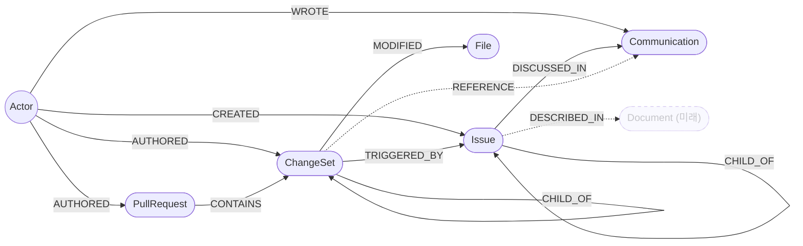

# Graph Schema — 지식 그래프 노드 & 관계 정의

## 노드 목록

### Actor
모든 소스(GitHub, Jira, Slack)의 사용자. ai-engine이 alias를 통합해 동일인을 하나의 노드로 합침.

```json
{
  "name": "",            // 표시 이름
  "aliases": [""],       // alias 통합 후 원본 ID 목록
  "email": ""            // alias 통합 시 동일인 판단 기준
}
```

---

### Issue
Jira 티켓.

```json
{
  "nodeType": "Issue",
  "source": "",                        // JIRA
  "occurredAt": "",                    // ISO-8601
  "actor": { "id": "", "name": "" },   // 소스별 사용자 ID, 표시 이름
  "properties": {
    "jira_key": "",                    // ira 고유 키 (예: HT-7)
    "title": "",                       // 티켓 제목
    "body": "",                        // 티켓 본문
    "status": "",                      // 현재 상태 (예: 진행 중)
    "issue_type": "",                  // Task | Bug | Story ...
    "priority": "",                    // 우선순위 (예: Medium)
    "assignee": ""                     // 담당자 이름
  },
  "refs": {}
}
```

---

### Communication
Slack 메시지 또는 GitHub Issue. 텍스트 기반 의사소통 단위.

```json
{
  "nodeType": "Communication",
  "source": "",                        // SLACK | GITHUB
  "occurredAt": "",                    // ISO-8601
  "actor": { "id": "", "name": "" },   // 소스별 사용자 ID, 표시 이름
  "properties": {
    "body": "",                        // 메시지 본문 (GitHub Issue는 title + "\n\n" + body)
    "channel": "",                     // Slack 채널명 또는 "github_issues"
    "url": "",                         // 원본 링크
    "conversation_id": ""              // Slack: 루트 메시지 ts / 스레드 reply는 부모 ts
                                       // GitHub Issue: issue number (string)
  },
  "refs": {}
}
```

---

### PullRequest
GitHub Pull Request.

```json
{
  "nodeType": "PullRequest",
  "source": "",                        // GITHUB
  "occurredAt": "",                    // ISO-8601
  "actor": { "id": "", "name": "" },   // 소스별 사용자 ID, 표시 이름
  "properties": {
    "pr_number": "",                   // PR 번호
    "title": "",                       // PR 제목
    "body": "",                        // PR 본문
    "state": "",                       // open | closed
    "base_branch": "",                 // 머지 대상 브랜치
    "merged_at": "",                   // 머지 시각 (ISO-8601), 미머지 시 null
    "url": ""                          // PR 링크
  },
  "refs": {}
}
```

---

### ChangeSet
GitHub Commit. 실제 코드 변경 단위.

```json
{
  "nodeType": "ChangeSet",
  "source": "",                        // GITHUB
  "occurredAt": "",                    // ISO-8601
  "actor": { "id": "", "name": "" },   // 소스별 사용자 ID, 표시 이름
  "properties": {
    "hash": "",                        // git commit hash
    "message": "",                     // 커밋 메시지
    "files": [
      {
        "path": "",                    // 파일 경로 → File 노드 upsert에 사용
        "diff": "",                    // unified diff 원문 → LLM diffSummary 생성에 사용
        "additions": 0,                // 추가된 라인 수
        "deletions": 0                 // 삭제된 라인 수
      }
    ]
  },
  "refs": {}
}
```

> **ai-engine 처리 흐름**
> - `files[].path` → File 노드 upsert
> - `files[].diff` → LLM이 diffSummary 생성 → `MODIFIED` 엣지 속성으로 저장
> - 처리 완료 후 `files[]` 배열은 Neo4j에 저장하지 않음

---

### File
GitHub 저장소 내 파일.

```json
{
  "path": "" // 파일 경로
}
```

---

### Document _(미래)_
장기 문서(기술 스펙, 설계 문서 등). 현재 미구현.

---

## 관계 목록

| 관계 | 방향 | 속성 | 설명 |
|------|------|------|------|
| `CREATED` | `(Actor)→(Issue)` | — | Actor가 Jira 티켓을 생성 |
| `WROTE` | `(Actor)→(Communication)` | — | Actor가 메시지/이슈를 작성 |
| `AUTHORED` | `(Actor)→(PullRequest)`, `(Actor)→(ChangeSet)` | — | Actor가 PR/commit을 생성 |
| `DISCUSSED_IN` | `(Issue)→(Communication)` | — | Jira 이슈가 특정 대화에서 언급됨 (`refs.jiraKey` 또는 `시간` 기반) |
| `CHILD_OF` | `(Issue)→(Issue)`, `(ChangeSet)→(ChangeSet)` | — | 이슈 계층 구조 (Sub-task → Parent), 커밋 계층 구조 |
| `TRIGGERED_BY` | `(ChangeSet)→(Issue)` | — | 이슈에 대한 커밋 |
| `CONTAINS` | `(PullRequest)→(ChangeSet)` | — | PR에 포함된 커밋 |
| `MODIFIED` | `(ChangeSet)→(File)` | `diffSummary: String` | 커밋이 파일을 변경. LLM이 생성한 diff 요약문의 임베딩 포함 |
| `REFERENCE` | `(ChangeSet)→(Communication)` | `confidence: Float (0-1)` | 벡터 유사도 기반 의미적 연결. `diffSummary`와 `body` 임베딩 코사인 유사도가 임계값 이상일 때 생성 |
| `DESCRIBED_IN` | `(Issue)→(Document)` | — | _(미래)_ Actor가 문서에 기술됨 |

---

## 그래프 구조 다이어그램



> 실선: 명시적 관계 (refs 추출 또는 구조적 포함 관계)
> 점선: 의미적/미래 관계 (`REFERENCE` — 벡터 유사도, `DESCRIBED_IN` — 미구현)

---

## 관계 생성 기준

ai-engine은 NormalizedEvent를 4개 레이어로 처리한다.

| 레이어 | 관계 | 생성 조건 | 근거 |
|--------|------|-----------|------|
| Layer 1 | `CREATED` / `WROTE` / `AUTHORED` | 모든 이벤트 | `actor` 필드 |
| Layer 1 | `CHILD_OF` (Issue) | Issue 이벤트 | Jira parent 필드 |
| Layer 2 | `DISCUSSED_IN` | `refs.jiraKey` 존재 시 | Communication의 refs |
| Layer 2 | `TRIGGERED_BY` | `refs.jiraKey` 존재 시 | ChangeSet의 refs |
| Layer 2 | `CONTAINS` | `refs.prNumber` 존재 시 | ChangeSet의 refs (※1) |
| Layer 3 | `MODIFIED` | ChangeSet 이벤트 | `files[].path` + LLM diffSummary |
| Layer 4 | `REFERENCE` | 배치 처리 | `diffSummary` ↔ `body` 코사인 유사도 ≥ threshold |

> ※1 `CONTAINS`는 커밋 메시지 텍스트 추출에 의존하므로 유실률이 높음.
> pipeline-worker에서 PR 컨텍스트로 커밋 정규화 시 `refs.prNumber`를 구조적으로 포함하도록 변경 권고.
>
> **순서 보장**: Layer 2에서 참조 대상 노드가 아직 없으면 PK만 가진 stub 노드를 생성하고,
> 해당 이벤트가 도착하면 Layer 1에서 properties를 채움.

---

## 문제: refs 의존도

refs(jiraKey, prNumber)는 텍스트 패턴 매칭으로만 추출된다. 개발자가 커밋 메시지나 Slack 메시지에 Jira key / PR 번호를 명시하지 않으면 refs는 비어 있다. **대부분의 데이터에서 refs는 존재하지 않을 가능성이 높다.**

refs에 의존하는 관계인 `DISCUSSED_IN`, `TRIGGERED_BY`, `CONTAINS`는 대부분 생성되지 않아 **Issue가 고립된 노드로 남을 위험**이 있다.

| 관계 | refs 없을 때 |
|------|-------------|
| `DISCUSSED_IN` (Issue ↔ Communication) | 연결 불가 |
| `TRIGGERED_BY` (ChangeSet ↔ Issue) | 연결 불가 |
| `CONTAINS` (PullRequest ↔ ChangeSet) | 연결 불가 (※1) |
| `MODIFIED` (ChangeSet → File) | 항상 가능 |
| `REFERENCE` (ChangeSet ↔ Communication) | 항상 가능 (시맨틱) |

---

## 해결 방안

### 방안 A — 시맨틱 유사도 (Layer 4 확장)

Layer 4의 임베딩 방식을 Issue 연결에도 적용한다.

```
Issue.title + body  ↔  Communication.body        → DISCUSSED_IN
Issue.title + body  ↔  ChangeSet.message + diffSummary  → TRIGGERED_BY
```

유사도 ≥ threshold인 쌍에 엣지 생성. threshold는 실험적으로 조정.

- 장점: 추가 데이터 불필요, 범용
- 단점: 도메인 용어가 겹치면 false positive 발생

---

### 방안 B — 시맨틱 + 시간 + Actor 조합

유사도에 시간·Actor 신호를 AND 조건으로 추가해 정밀도를 높인다.

```
조건 1: 유사도 ≥ threshold
조건 2: occurredAt이 Issue 활성 기간 내 (생성 ~ 완료)
조건 3: 같은 Actor 또는 팀 내 collaborator
```

만족하는 조건 수에 따라 confidence를 다르게 부여할 수도 있다.

- 장점: A 단독보다 false positive 감소
- 단점: Actor가 여러 이슈를 동시 진행 중이면 여전히 노이즈 존재

---

### 방안 C — 스레드 전파 (Communication 특화)

Communication은 `conversation_id`로 스레드가 묶여 있다. 스레드 내 하나의 메시지에만 refs가 있어도 그 스레드 전체에 같은 Issue 연결을 전파한다.

```
thread (conversation_id: "1773799131")
  ├── "PAYMENT-301 확인했어요"   ← refs.jiraKey 있음 → DISCUSSED_IN 생성
  ├── "PR 내일 올릴게요"          ← refs 없음 → 스레드 전파로 DISCUSSED_IN 생성
  └── "고마워요!"                 ← refs 없음 → 스레드 전파로 DISCUSSED_IN 생성
```

- 장점: 비용 없음, refs가 극히 일부만 있어도 커버리지 향상
- 단점: Communication에만 적용 가능

---

### 방안 D — 2단계: 임베딩 후보 선별 → LLM 검증

방안 A와 동일하게 임베딩 유사도로 시작하지만, 유사도를 **최종 판단**으로 쓰지 않고 **후보 선별 도구**로만 사용한다. 최종 판단은 LLM이 실제 텍스트를 읽고 내린다.

방안 A의 한계: 임베딩 유사도는 도메인 용어가 겹치면 내용이 달라도 높은 점수가 나온다.

```
Issue.title:          "낙관적 락으로 교체 필요"
ChangeSet.diffSummary: "비관적 락 방식의 문제점 발견, 추가 조사 필요"
→ 임베딩 유사도 높음 (락/낙관/비관 용어 겹침)
→ 하지만 Issue는 해결책, ChangeSet은 문제 발견 단계 — 실제로는 무관할 수 있음
→ 방안 A: 엣지 생성 (false positive)
→ 방안 D: LLM이 내용을 읽고 "관련 없음" 판단 → 엣지 미생성
```

```
Stage 1 (저비용): 임베딩 유사도로 상위 K개 후보 쌍 선별  ← 방안 A와 동일
Stage 2 (LLM):   후보 쌍의 실제 텍스트를 읽고 관련 여부 판단 → confidence 부여
```

LLM은 문맥, 부정, 인과관계를 이해할 수 있어 임베딩이 놓치는 false positive를 걸러낸다.

- 장점: 방안 A보다 높은 정확도, 전체 N×M을 LLM에 돌리지 않아 비용 절감
- 단점: Stage 1에서 놓친 후보(false negative)는 Stage 2에서 회복 불가

---

### 클로드 권장 조합

| 연결 | 권장 방안 |
|------|-----------|
| Issue ↔ Communication | 방안 C (스레드 전파) + 방안 A (시맨틱) |
| Issue ↔ ChangeSet | 방안 B (시맨틱 + 시간 + Actor) |
| 정확도 우선 | 방안 D (2단계 LLM 검증) 선택 적용 |
